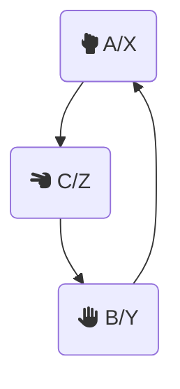

# Day 2

The year is 1999, Matrix has just been released, and so has [C99](https://wikipedia.org/wiki/C99), one of the revisions of the **C** programming language, and it's going to be language used for this day.

Buckle up, because this is going to get overly complicated very soon.


## Solution

Rock, paper and scissors are represented by different letters, so I mapped them into this chart:



Now, let $x \in \{A, B, C\}$  be the the opponent's play and $y \in \{X, Y, Z\}$  our play. These correspond to the first and second columns of the input, respectively.

Since in [ASCII](https://en.wikipedia.org/wiki/ASCII), the characters have different values, let's offset let them, so that both plays have the same value (since they are both representing the same shape, *e.g.* $A \equiv X \equiv Rock$).

To do so, we subtract the decimal ASCII value of the shape with the lowest value: $A \rightarrow 65; X \rightarrow 88$.

$y = y - 65$

$x = x - 88$

This produces the following mapping:

$$
\begin{cases}
    {A, X} \gets 0 \\
    {B, Y} \gets 1 \\
    {C, Z} \gets 2
\end{cases}
$$

After this, instead of:

```
A Y
B X
C Z
```

We have:

```
0 1
1 0
2 2
```

Now, we have to calculate the score for each round, $R$. The score is composed of two elements, the score for the selected shape, $S$, and the outcome of the round, $O$.

### Shape score

The shape score can take one of three values:

$$
S = 
\begin{cases}
    0, \text{Defeat} \\
    3, \text{Draw} \\
    6, \text{Victory} 
\end{cases}
$$

Let $\delta = x - y$.

Now, interpreting this value as the outcome of the round, $S'$.

$$
\delta = S' = 
\begin{cases}
    -1, \text{Defeat} \\
    0, \text{Draw} \\
    1, \text{Victory} 
\end{cases}
$$

However, for **Rock (A)** *vs* **Scissors (Z)**:

$$
\begin{aligned}
S' &= A - Z \\
   &= 0 - 2 \\
   &= -2
\end{aligned}
$$

$-2$ should not be of the possible values of $S'$. Instead, the intended correct value is $1$ (a victory for rock).

This is because the value $0$ of $A$ should actually be $3$ to comply with the scheme of the chart, *i. e* every winning shape's value, $W$ is the losing shape's value, $L$, plus one $W = L + 1$.

However, due to the cyclic nature of the game, $3$ becomes $0$, as every value is in modulus 3, $3 \equiv 0 \mod 3$.

To get around this, we need to make sure $S' \in \{-1, 0, 1\}$, so:

$$
S' = (delta + 1) \bmod 3 - 1,
$$

Finally, to map $S'$ to $S$:

$$
S = 3 (S' + 1)
$$

### Outcome score

The outcome score as well can take one of three values, depending on our play, $y$:

$$
O = 
\begin{cases}
    1, \text{Rock} \\
    2, \text{Paper} \\
    3, \text{Scissors} 
\end{cases}
$$

So, we just add one to our play value:

$$O = y + 1$$

### Round score

After calculating both scores, we obtain:

$$\therefore R = S + O$$